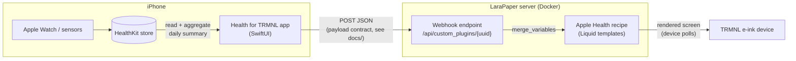

# TRMNL Apple Health

Apple Health on your TRMNL e-ink display.

TRMNL Apple Health is two things that speak one language:

- **An iOS app** (`ios/`) that reads your Apple Health data — steps, distance, active energy, exercise minutes, resting heart rate, weight, and sleep with stages — aggregates it into a small daily summary, and POSTs it to your TRMNL server.
- **A TRMNL recipe** (`recipe/`) that renders that summary as a clean numbers dashboard on the e-ink display, in all four TRMNL view sizes.

Between them sits a documented, versioned **JSON contract** (`docs/`): the app is tested to produce it, the recipe is built to render it, and CI validates both against the same schema file. Anything that can POST JSON matching the schema can feed the recipe — the app is the reference producer, not the only possible one.

Designed for self-hosting with [LaraPaper](https://github.com/usetrmnl/larapaper) (TRMNL BYOS); works against trmnl.com webhook plugins too.

> Status: v1 — manual sync. Open the app, tap Sync, your dashboard updates. Background delivery (self-updating, no app launch) is the next milestone.

## How it works



1. Health data only exists on your iPhone — Apple provides no cloud API. The app reads it locally via HealthKit and computes one compact summary for the current day (about 1&nbsp;KB of JSON).
2. The app POSTs `{"merge_variables": {...}}` to your plugin's webhook URL. The payload shape is the contract in [`docs/schema/health-summary.v1.schema.json`](docs/schema/health-summary.v1.schema.json) (example: [`docs/examples/payload.example.json`](docs/examples/payload.example.json)). Every metric is optional — deny a permission and its key is simply omitted.
3. Your server stores the variables and renders the recipe's Liquid templates into the screen your TRMNL device polls.

Privacy model: the data goes from your phone to a server you run. No third party, no cloud account, no analytics.

## Setup

You need: a TRMNL device (or the [BYOD](https://docs.trmnl.com/go/diy/byos) route), a server running [LaraPaper](https://github.com/usetrmnl/larapaper), a Mac with Xcode to build the app, and an iPhone (iOS 17+).

### 1. Run LaraPaper

`dev/docker-compose.yml` works for production as well as local testing:

```bash
export APP_KEY="base64:$(openssl rand -base64 32)"
docker compose -f dev/docker-compose.yml up -d
open http://localhost:4567   # register a user, connect your TRMNL device
```

For a permanent deployment (Raspberry Pi, NAS, VPS): same file, plus set `APP_URL` and `REGISTRATION_ENABLED=0` after registering. One thing to plan: **your iPhone must be able to reach this server** when syncing — same Wi-Fi is fine for a start; Tailscale or a public HTTPS endpoint if you want syncs from anywhere.

### 2. Install the recipe and get your webhook URL

```bash
gem install trmnl_preview           # the trmnlp CLI (Ruby >= 3.4)
cd recipe
trmnlp login --server http://YOUR-SERVER:4567   # API token from the LaraPaper UI
trmnlp push
```

In LaraPaper, add the plugin to your device's playlist and copy the plugin's **webhook URL** (`http://YOUR-SERVER:4567/api/custom_plugins/<uuid>`).

Using trmnl.com instead: create a private plugin with the *Webhook* strategy (Developer add-on required), paste the recipe markup, and use its webhook URL — the payload fits trmnl.com's 2&nbsp;KB limit by design.

### 3. Build the app onto your iPhone

```bash
brew install xcodegen
cd ios && xcodegen generate && open HealthForTRMNL.xcodeproj
```

In Xcode: select your Apple ID under *Signing & Capabilities* (a free account works — the app just re-signs every 7 days), plug in your iPhone, press Run. On the phone, enable *Settings → Privacy & Security → Developer Mode* the first time.

### 4. Connect them

Launch the app → the welcome screen requests Health permissions → paste your webhook URL in Settings → **Sync Now**. Your TRMNL shows the dashboard on its next refresh.

## Development

```bash
# Recipe: live preview at http://localhost:4567 (sample data from .trmnlp.yml)
cd recipe && trmnlp serve

# iOS: build and test in the Simulator
cd ios && xcodegen generate
xcodebuild test -project HealthForTRMNL.xcodeproj -scheme HealthForTRMNL \
  -destination 'platform=iOS Simulator,name=iPhone 17'

# Validate a payload against the contract
npx --yes --package=ajv-cli@5 --package=ajv-formats ajv validate \
  --spec=draft2020 -c ajv-formats \
  -s docs/schema/health-summary.v1.schema.json \
  -d docs/examples/payload.example.json
```

The Simulator has a working Health app (you can add sample steps/sleep manually), so the whole pipeline — app → LaraPaper in Docker → rendered screen — runs end-to-end on one Mac with no physical device.

### Changing the contract

The schema is additive-only within a major version: new metrics are added as *optional* properties, in the same PR that teaches the app to send them and (optionally) the recipe to show them. Never rename, retype, or change the unit of an existing key. CI enforces schema validity, fixture conformance, recipe lint, and the app's encoder output on every push.

## Repository layout

| Path | Contents |
|---|---|
| `ios/` | Health for TRMNL iOS app (SwiftUI + HealthKit, iOS 17+). Xcode project generated via [XcodeGen](https://github.com/yonaskolb/XcodeGen) from `project.yml` |
| `recipe/` | TRMNL recipe (Liquid templates, [trmnlp](https://github.com/usetrmnl/trmnlp) project) |
| `docs/` | The payload contract: JSON Schema + example fixture |
| `dev/` | LaraPaper via Docker Compose (local testing and production) |

## Roadmap

- HealthKit background delivery (self-updating dashboard, no app launch needed)
- More metrics (HRV, stand hours, water, workouts) — additive schema changes
- Recipe publication to the TRMNL recipe catalogs

## License

[MIT](LICENSE)
