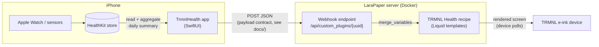

# TRMNL Health

Apple Health on your TRMNL e-ink display — an iOS app that reads HealthKit data and pushes a daily summary to a self-hosted [LaraPaper](https://github.com/usetrmnl/larapaper) server (or trmnl.com), rendered by a matching TRMNL recipe.

> Status: v1 in development — schema contract, recipe, and iOS app (manual sync) are functional. Background sync is on the roadmap.

## Architecture



The JSON payload the app sends and the recipe renders is a documented, versioned
contract: [`docs/schema/health-summary.v1.schema.json`](docs/schema/health-summary.v1.schema.json)
(example: [`docs/examples/payload.example.json`](docs/examples/payload.example.json)).
Anything that can POST JSON matching the schema can feed the recipe. Both halves
are tested against the same schema file in CI.

## Repository layout

| Path | Contents |
|---|---|
| `ios/` | TrmnlHealth iOS app (SwiftUI + HealthKit, iOS 17+). Xcode project generated via [XcodeGen](https://github.com/yonaskolb/XcodeGen) from `project.yml` |
| `recipe/` | TRMNL recipe (Liquid templates, [trmnlp](https://github.com/usetrmnl/trmnlp) project) |
| `docs/` | The payload contract: JSON Schema + example fixture |
| `dev/` | Local development environment (LaraPaper via Docker Compose) |

## Development

```bash
# Recipe: live preview at http://localhost:4567 (sample data from .trmnlp.yml)
cd recipe && trmnlp serve

# iOS: generate the Xcode project, build and test
cd ios && xcodegen generate
xcodebuild test -project TrmnlHealth.xcodeproj -scheme TrmnlHealth \
  -destination 'platform=iOS Simulator,name=iPhone 17'

# Validate a payload against the contract
npx --yes --package=ajv-cli@5 --package=ajv-formats ajv validate \
  --spec=draft2020 -c ajv-formats \
  -s docs/schema/health-summary.v1.schema.json \
  -d docs/examples/payload.example.json

# Local LaraPaper for end-to-end testing
export APP_KEY="base64:$(openssl rand -base64 32)"
docker compose -f dev/docker-compose.yml up -d
```

## Roadmap

- HealthKit background delivery (self-updating dashboard, no app launch needed)
- More metrics (HRV, stand hours, water, workouts) — additive schema changes
- Recipe publication to the TRMNL recipe catalogs
