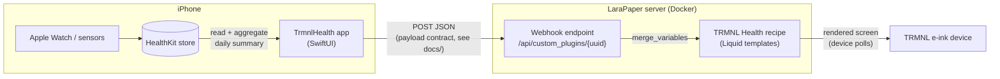

# TRMNL Health

Apple Health on your TRMNL e-ink display — an iOS app that reads HealthKit data and pushes a daily summary to a self-hosted [LaraPaper](https://github.com/usetrmnl/larapaper) server (or trmnl.com), rendered by a matching TRMNL recipe.

> Status: early development. Nothing is functional yet.

## Architecture



The JSON payload the app sends and the recipe renders is a documented contract
(see `docs/`, forthcoming) — anything that can POST JSON can feed the recipe.

## Repository layout

| Path | Contents |
|---|---|
| `ios/` | TrmnlHealth iOS app (SwiftUI + HealthKit). Xcode project generated via [XcodeGen](https://github.com/yonaskolb/XcodeGen) from `project.yml` |
| `recipe/` | TRMNL recipe (Liquid templates, [trmnlp](https://github.com/usetrmnl/trmnlp) project) |
| `dev/` | Local development environment (LaraPaper via Docker Compose) |
| `docs/` | Payload schema / contract (forthcoming) |

## Development

```bash
# Recipe: live preview at http://localhost:4567
cd recipe && trmnlp serve

# iOS: generate the Xcode project, then build
cd ios && xcodegen generate

# Local LaraPaper for end-to-end testing
export APP_KEY="base64:$(openssl rand -base64 32)"
docker compose -f dev/docker-compose.yml up -d
```
